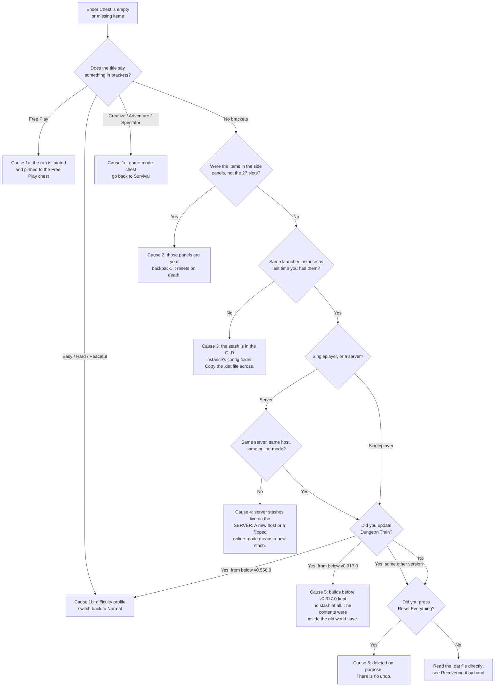

# I lost my Ender Chest

**Start here: almost nothing is ever actually deleted.** Dungeon Train does not keep one Ender Chest — it keeps
several, and the block in front of you opens whichever one matches your *profile*: your game mode, your
difficulty, and whether the run counts as Free Play. An empty chest almost always means you are looking at a
different chest, not a lost one.

This page is a decision tree. Work down it in order — the checks are cheapest first.

- [The 30-second check](#the-30-second-check)
- [Flow chart](#flow-chart)
- [Cause 1 — the chest is labelled](#cause-1--the-chest-is-labelled)
- [Cause 2 — the items were in your backpack](#cause-2--the-items-were-in-your-backpack)
- [Cause 3 — you moved instance, launcher or install](#cause-3--you-moved-instance-launcher-or-install)
- [Cause 4 — server vs singleplayer](#cause-4--server-vs-singleplayer)
- [Cause 5 — which version did you come from?](#cause-5--which-version-did-you-come-from)
- [Cause 6 — Reset Everything](#cause-6--reset-everything)
- [Where the stash actually lives](#where-the-stash-actually-lives)
- [Recovering it by hand](#recovering-it-by-hand)
- [When it really is gone](#when-it-really-is-gone)
- [Reporting it](#reporting-it)

---

## The 30-second check

1. **Open the Ender Chest and read the title bar.** Since v0.556.0 any chest that is *not* your default one
   says so: `Ender Chest (Hard)`, `Ender Chest (Adventure · Hard)`, `Ender Chest (Free Play)`. A plain
   `Ender Chest` with no bracket is your default survival + Normal chest.
2. **Count the slots.** The Ender Chest is the 27 slots in the middle. The panels either side of it are your
   [Edible Backpack](Features), not the chest.
3. **Check you are in the same launcher instance you played in before.** The stash is stored per install, not
   per Minecraft account.

If all three look right, keep reading.

---

## Flow chart



---

## Cause 1 — the chest is labelled

Only chests that differ from the default get a label, so a labelled chest is always a signpost.

| Title | What you are looking at | Fix |
|---|---|---|
| `Ender Chest (Free Play)` | The run is tainted, and is pinned to a throwaway Free Play chest so cheated items can never reach your real one. Your real chest is untouched. | See below |
| `Ender Chest (Hard)` / `(Easy)` / `(Peaceful)` | The per-difficulty profile added in **v0.556.0**. Each difficulty stashes separately. | Set the difficulty back to **Normal** |
| `Ender Chest (Creative)` / `(Adventure)` / `(Spectator)` | The per-game-mode split added in **v0.317.0**. | Go back to **Survival** |
| `Ender Chest (Adventure · Hard)` | Both at once. | Survival + Normal |
| `Ender Chest` (no brackets) | Your default chest. This one really is empty. | Keep reading |

### 1a — Free Play

A run becomes Free Play when you go creative, spectator or cinematographer mode, or run a non-allowlisted
command. The taint sticks to that world: it survives relog and respawn, and a brand-new world starts clean.

Four other things turn Free Play on without you touching a command:

- **`keepInventory` is on.** This one is world-wide and **does not clear** — that world is Free Play forever.
- **`config/adventureitemstats.properties` has been edited** away from Adventure Item Stats' own defaults. Run
  **`/fixaisconfig`** in chat to restore them (it backs the old file up first), then restart. This clears itself.
- **A known cheat mod is installed**, or **custom Train Editor content is loaded**. Both clear when the cause
  goes away.
- **Someone with cheats is online.** Clears when they leave; the operator's own run stays marked.

Nothing you had is lost — your legit chest is neither read nor written during a Free Play run. Clear the cause
(or start a fresh world) and it comes back exactly as you left it.

### 1b — Difficulty profiles (v0.556.0)

From v0.556.0 each vanilla difficulty is its own self-contained run with its own Ender Chest, carried
inventory and echoes. **Normal is the legacy profile** — every stash that existed before the split belongs to
Normal, so nothing moved. Easy, Hard and Peaceful all started empty on purpose.

So: if you updated to v0.556.0 or later and were playing on Hard, your stash did not vanish, it is on Normal.

To turn the split off entirely and share one stash across all four difficulties, set this in
`config/dungeontrain-server.toml`:

```toml
difficultyIsolatedStash = false
```

That is a global file, not per-world. On a server it is the server's copy that counts.

---

## Cause 2 — the items were in your backpack

Since **v0.742.0** the Edible Backpack panels are drawn either side of chests, ender chests, barrels and
shulker boxes — so items sitting in the panels *look* like they are in the Ender Chest you just opened. They
are not. The Ender Chest is the 27 slots in the middle.

Two things to know about backpacks in Dungeon Train:

- **Dying costs you the backpack** — the contents *and* the slots. That is deliberate; it is the bet the
  feature is built around. Nothing is recoverable.
- **Before v0.657.0**, backpack contents were genuinely voided by a relog or a respawn. That was a bug, fixed
  by shipping Edible Backpacks 0.11.0. If you lost items that way on an older build, they are gone — update.

Edible Backpacks arrived in **v0.592.0**. If you last played before that, the panels are new to you and were
never holding anything.

---

## Cause 3 — you moved instance, launcher or install

**This is the most common real cause.** The stash is stored in your install's `config/` folder:

```
<instance folder>/config/enderchestpersistence/<your-uuid>.dat
```

Not in the world save, and not in one shared place. Every one of these is a *different* install with a
*different* config folder and therefore a different, empty stash:

| You did this | Result |
|---|---|
| Played in the **CurseForge app**, then installed the **Modrinth** pack | New stash |
| Played the **modpack**, then made a **manual** `.minecraft` install (or the reverse) | New stash |
| Made a **new instance** to update instead of updating in place | New stash |
| Used **MultiMC / Prism / ATLauncher** alongside the official launcher | New stash |
| Reinstalled the pack and let the launcher create a fresh instance | New stash |

The old file is still on your disk. See [Recovering it by hand](#recovering-it-by-hand) — this is a
copy-one-file fix.

---

## Cause 4 — server vs singleplayer

The stash is written **wherever the game logic runs**:

- **Singleplayer / Open to LAN** — your own machine, in your instance's `config/`.
- **A dedicated server** — the *server's* `config/enderchestpersistence/`, on the host machine. Your own PC
  never sees it.

So a singleplayer stash and a server stash are separate, and always have been. And on the server side:

- **The server was reinstalled, migrated, or you changed host** — the stash lives with the old server files.
  Ask the owner to copy `config/enderchestpersistence/` across.
- **`online-mode` was switched on or off.** Your player UUID changes with it, and the stash is keyed by UUID —
  so the server looks for a file that has never existed. The old file is still there under the old UUID.

---

## Cause 5 — which version did you come from?

| From → to | What happens to your chest |
|---|---|
| Below **v0.317.0** → anything | Builds before v0.317.0 had no persistence at all. The chest was ordinary vanilla, stored **inside the world save**. It never carried forward, and when that world went, it went. |
| **v0.317.0 – v0.478.x** → **v0.479.0+** | Nothing. Ender Chest Persistence moved from being bundled inside Dungeon Train's jar to a separate required download, but the file path is unchanged. Manual jar installers get a missing-dependency screen on launch and must download the sibling mods — the game will not start without them, so this cannot silently lose a stash. |
| Below **v0.329.0** → **v0.329.0+** | Free Play runs got their own chest. If your run is tainted you will see `(Free Play)`. See [1a](#1a--free-play). |
| Below **v0.556.0** → **v0.556.0+** | **The big one.** Difficulty profiles arrived. Your entire existing stash belongs to **Normal**; Easy, Hard and Peaceful start empty. See [1b](#1b--difficulty-profiles-v05560). |
| Below **v0.592.0** → **v0.592.0+** | Edible Backpacks arrived. New side panels appear — they are not the chest. |
| Below **v0.657.0** → **v0.657.0+** | Fixes backpack contents being voided on relog/respawn. Anything lost to that before updating is unrecoverable. |
| Below **v0.742.0** → **v0.742.0+** | Backpack panels start appearing *inside* the Ender Chest screen. Nothing moved; the screen just got wider. |

Your installed version is on the title-screen overlay and on the **Mods** screen.

---

## Cause 6 — Reset Everything

The **Reset Everything** button on the Video Tools page (**v0.634.0**) deletes the Ender Chest stash for every
game mode and every difficulty, along with your advancements, stats, story progress, past lives and your
Dungeon Train worlds. It names every world it will delete and makes you type `DELETE` first.

There is no undo, and the file is removed rather than backed up. If you ran it, that is the answer.

---

## Where the stash actually lives

```
<instance folder>/config/enderchestpersistence/<player-uuid>.dat
```

- One file per player, gzipped NBT.
- It sits **outside every world save** — that is the whole point, and why it survives dying and starting a new
  world.
- Inside, each profile is a separate top-level list, keyed by slot:

| Key in the file | Which chest |
|---|---|
| `survival` | Survival, Normal — the default one |
| `survival\|hard`, `survival\|easy`, `survival\|peaceful` | Survival on that difficulty |
| `creative` | Creative **and every Free Play run** |
| `adventure`, `spectator` | Those game modes (plus `\|<difficulty>` variants) |

Normal has no suffix — that is why the split in v0.556.0 moved nothing.

**There are no automatic backups.** The file is rewritten in place on logout and server stop. Copy it somewhere
safe before experimenting.

---

## Recovering it by hand

### Finding the old file

Search your whole drive for the folder name `enderchestpersistence`. Every hit is one install's stash.

| OS | Typical places to look |
|---|---|
| Windows | `%appdata%\.minecraft\config\`, `%appdata%\CurseForge\Instances\<pack>\config\`, `%appdata%\ModrinthApp\profiles\<pack>\config\`, `%appdata%\PrismLauncher\instances\<name>\.minecraft\config\` |
| macOS | `~/Library/Application Support/minecraft/config/`, `~/Library/Application Support/ModrinthApp/profiles/<pack>/config/`, `~/curseforge/minecraft/Instances/<pack>/config/` |
| Linux | `~/.minecraft/config/`, `~/.local/share/ModrinthApp/profiles/<pack>/config/`, `~/.local/share/PrismLauncher/instances/<name>/.minecraft/config/` |

Sort the hits by date modified — the newest one is the install you are playing now, and the one you want is
usually the one just before it.

### Moving it across

1. **Quit Minecraft completely.** The stash is held in memory while you play and flushed on exit, so a copy
   made with the game running will be overwritten.
2. Copy `<old instance>/config/enderchestpersistence/<uuid>.dat` into
   `<new instance>/config/enderchestpersistence/`.
3. If a file with that name is already there, keep it as `<uuid>.dat.bak` first — you cannot merge the two,
   only pick one.
4. Start the game and open the chest.

If the folder holds several `.dat` files, they are different accounts. Your UUID is on your Mojang/Microsoft
profile, or in the server's `usercache.json`.

### Moving items between profiles

If your items are in a profile you no longer want to play on (say they are under `survival` and you want to
play on Hard), you have two options:

- **The easy one:** set `difficultyIsolatedStash = false` in `config/dungeontrain-server.toml`. Every
  difficulty then shares the un-suffixed stash, exactly as builds before v0.556.0 did.
- **The precise one:** open the `.dat` in an NBT editor (NBTExplorer, or the online NBT viewer of your choice)
  with the game closed, and rename or copy the list from one key to another — `survival` → `survival|hard`.

---

## When it really is gone

Be straight about the four cases nothing recovers:

1. **Reset Everything was used.** Deliberate deletion, no backup.
2. **The world predates v0.317.0** and has since been deleted. The chest lived in that world save.
3. **Backpack contents on death.** Working as designed.
4. **The `.dat` file itself was deleted** and no launcher/OS backup exists. There is only ever one copy.

Everything else on this page is a file that still exists somewhere, or a chest you are not currently looking at.

---

## Reporting it

If none of the above fits, bring these five things and the answer is usually immediate:

1. The **exact title text** on the Ender Chest screen, including anything in brackets.
2. Your **Dungeon Train version** (Mods screen or the title-screen overlay), and the version you updated *from*.
3. **How you installed it** — CurseForge app, Modrinth app, modpack, or manual jar — and whether that changed.
4. **Singleplayer or server**, and the difficulty and game mode you were on.
5. Whether `config/enderchestpersistence/<uuid>.dat` exists and how big it is.

---

## Related pages

- [Installation](Installation) — install order and the required sibling mods
- [Features](Features) — Free Play, AIS data integrity and `/fixaisconfig`
- [Compatibility](Compatibility) — sibling-mod and modpack notes
- [Downloads](Downloads) — current release
